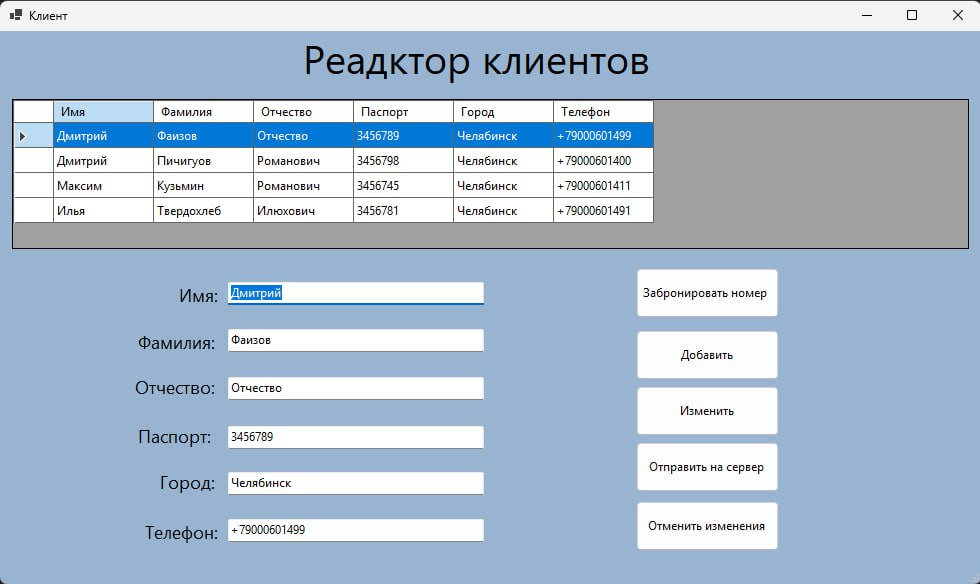
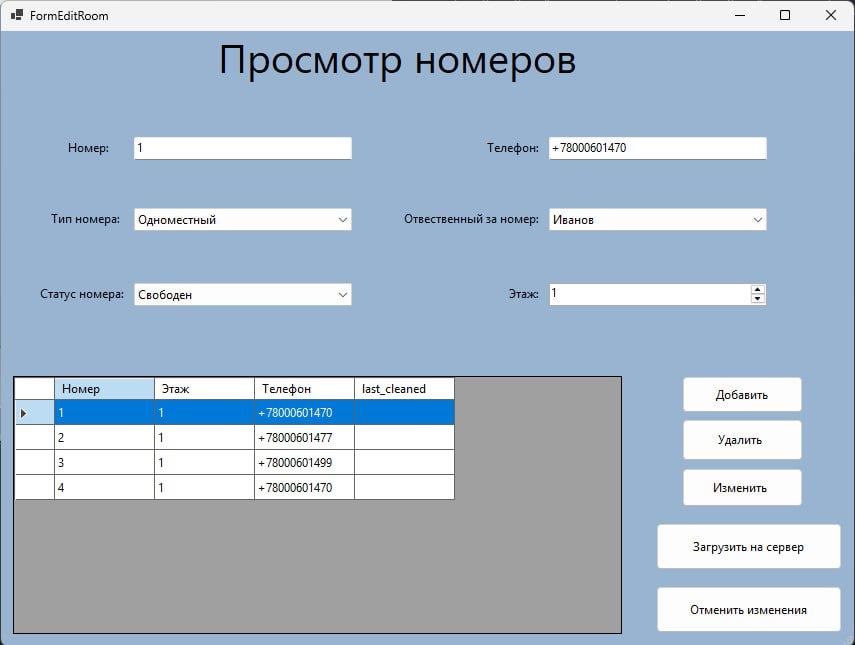
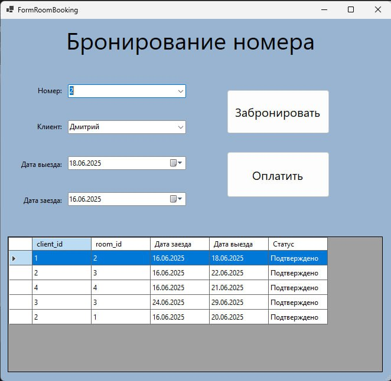
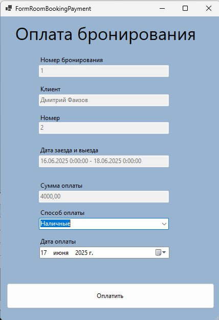
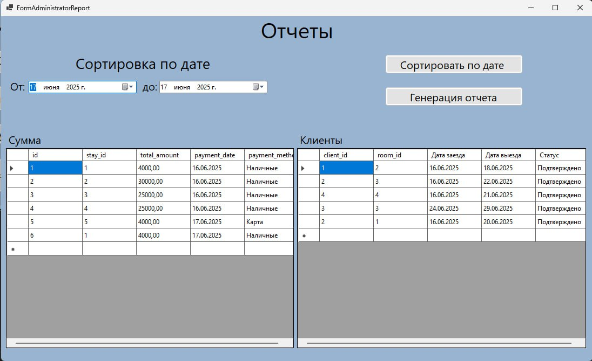

  <h1>Автоматизированная система управления гостиницей (АСУ «Гостиница»)</h1>

  
Данное приложение — учебный проект по автоматизации работы небольшой гостиницы. Разработано в рамках курсовой работы по направлению <em>Прикладная информатика</em> (профиль: <em>Разработка веб- и мобильных приложений</em>).

  <h2>Описание</h2>
  
Система предназначена для внутреннего использования администратором и персоналом гостиницы. Она позволяет:

  <ul>
    <li>Управлять клиентами (добавление, редактирование, поиск);</li>
     
    <li>Вести учёт номеров (статус, тип, стоимость, наличие телефона);</li>
     
    <li>Оформлять бронирования и проживание;</li>
     
    <li>Формировать счета за проживание;</li>
     
    <li>Генерировать квартальные отчёты (доходы, загруженность, статистика клиентов).</li>
     
  </ul>
  
Приложение <strong>не требует подключения к интернету</strong> и ориентировано на локальное использование в малых и средних гостиницах.

  <h2>Технологии</h2>
  <ul>
    <li><strong>Язык</strong>: C#</li>
    <li><strong>Фреймворк</strong>: .NET (Windows Forms)</li>
    <li><strong>База данных</strong>: Microsoft SQL Server</li>
    <li><strong>Архитектура</strong>: Реляционная БД, нормализованная до 3НФ</li>
    <li><strong>Основные компоненты</strong>: <code>DataSet</code>, <code>DataAdapter</code>, <code>DataGridView</code>, <code>ComboBox</code>, <code>DateTimePicker</code></li>
  </ul>

  <h2>Основные функции</h2>
  <ul>
    <li>Работа с клиентами и их паспортными данными</li>
    <li>Управление персоналом (приём, увольнение)</li>
    <li>Бронирование и оплата номеров</li>
    <li>Проверка уникальности паспорта и телефона</li>
    <li>Контроль занятости номеров</li>
    <li>Автоматический расчёт стоимости проживания</li>
    <li>Формирование отчётов по периоду</li>
  </ul>

  <h2>Структура БД (основные таблицы)</h2>
  <ul>
    <li><code>client</code> — клиенты</li>
    <li><code>staff</code> — сотрудники</li>
    <li><code>room</code> — номера</li>
    <li><code>booking</code> — бронирования</li>
    <li><code>stay</code> — фактическое проживание</li>
    <li><code>invoice</code> — счета</li>
    <li>Справочники: <code>room_type</code>, <code>room_status</code>, <code>staff_status</code></li>
  </ul>

  <h2>Запуск</h2>
  <ol>
    <li>Убедитесь, что установлен SQL Server и восстановлена база данных <code>hotel</code>.</li>
    <li>Настройте строку подключения в файле конфигурации.</li>
    <li>Запустите приложение через <code>Form1</code> (главное меню).</li>
  </ol>
  <blockquote>
    
<strong>Примечание</strong>: Проект разработан как учебный пример и не включает онлайн-бронирование или веб-интерфейс.

  </blockquote>

